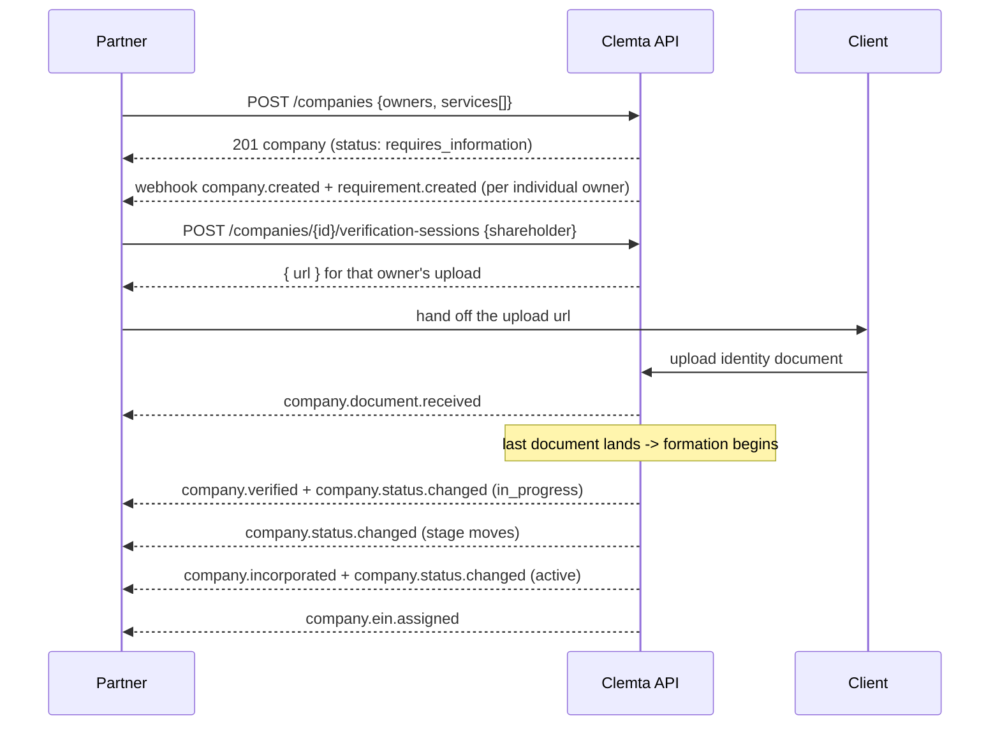
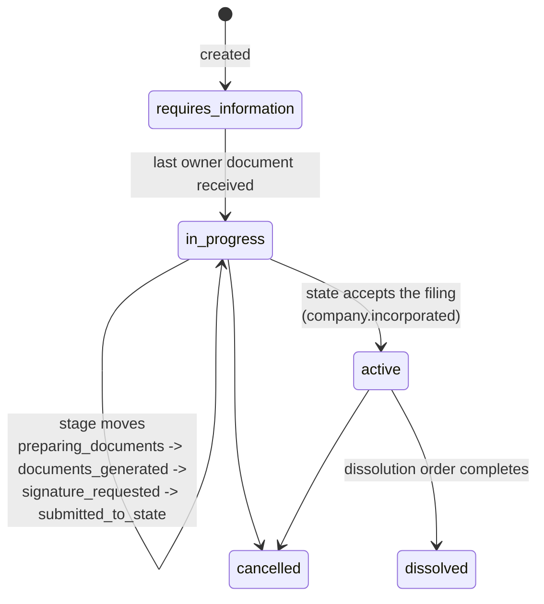

## Creating a company

[`POST /companies`](/api-reference/create-company) takes the entity (name, state, type, ending, industry,
shares), its owners, the customer it belongs to, and optionally the services
to attach at the same time. Everything lands in **one transaction**: the
account (if created inline), the company, its service orders, the charges,
and the [`company.created`](/api-reference/webhooks/company-created) event - all or nothing.

### Input rules

The API validates every field server-side:

- **`name`** - IRS naming rules: letters, numbers, spaces, `-` and `&` only,
  and never a leading "The". The suffix is the separate `ending` field.
  `name_style: comma` renders "Acme, LLC" and the company returns the
  assembled `legal_name` read-only.
- **`owner_privacy`** - `public` (default) or `private`: whether the owners
  are kept off the public filing. It is the customer's choice, and only the
  states that offer it accept `private` (DE, NV, WY, NM).
- **`ending`** is an API token and must match the entity type. LLC: `llc`,
  `l_l_c`, `limited_liability_company`. C-Corp: `inc`, `incorporated`, `co`,
  `corp`, `corporation`. The rendered legal text ("L.L.C.", "Inc.") appears
  in `legal_name`.
- **`industry`** is one of the platform catalog's 36 tokens (`accounting` ...
  `transportation`, plus `other`). An unknown value is rejected with a
  did-you-mean suggestion. `other` requires both `custom_industry` (the custom
  industry's short name) and `industry_description` (the free-text
  description). Every other value refuses both.
- **Owners** - each individual or company owner needs email, phone, a title
  and a complete address (filing charset: letters, numbers and
  `& . , : ; ' # -`). `tax_id` is validated and normalized to the standard
  masks: `123-45-6789` (ssn/itin), `12-3456789` (ein). Ownership must total
  100 with exactly one representative, and every named owner's
  `percent_ownership` must be above 0.
- **Owner text fields** - `first_name` and `last_name` take English letters
  and spaces only. A company owner's `name` and `representative_name` take
  letters, numbers, spaces and `& . , -`. `email` must be a valid address.
  `phone_country` (optional) is an ISO 3166 alpha-2 code.
- **Owner role** - `relationship.title` is a position token (`sole_owner`,
  `ceo` ... `operations_manager`, or `other`). `other` requires
  `custom_title` (filing charset), every other token refuses one.
- **Owner identity** - no two owners may share an email or a tax id.
- **`pre_existing` companies** - `address` is required (an existing company
  has a legal address by definition). `ein` and `foreign_qualifications[]`
  stay optional. All three are rejected on companies Clemta forms. The
  incorporation date is never an input: a `formation_document` requirement
  opens at creation, your client uploads the formation document, and Clemta
  reads the date off it before onboarding completes.
- **Shares and units** - a **C-Corp** declares `authorized_shares` and
  `par_value` (both required), and each owner's `percent_ownership` must
  resolve to a whole number of shares (33.4% of 1,000 shares works - 33.33% of
  3 does not). An **LLC** has no share count to set: it is issued a fixed 100
  membership units, so `authorized_shares` and `par_value` are not accepted on
  an LLC and are rejected if sent.
- **Owners are optional at create.** Omit `shareholders`, or send `[]`, and
  supply them later before formation begins (see [Updating a
  company](#updating-a-company)). A company still needs its complete owner set,
  each individual owner's identity document included, before Clemta forms it.

<Info>
  **An LLC's owners are its members.** The request field is `shareholders` for
  every entity type, but an LLC has no shareholders in law. Its owners are
  **members** holding membership units, and an LLC carries a `management_type`
  of `member_managed` or `manager_managed`. A C-Corp's `shareholders` are true
  shareholders holding shares. The field name is shared, the legal meaning
  follows the entity type, so read `shareholders` as "members" on an LLC.
</Info>



### Updating a company

[`POST /companies/{id}`](/api-reference/update-company) is a sparse update - send only the fields you want
changed. What it accepts depends on where the company is:

- **Before formation begins** (`status: requires_information`): the
  create-time details can still be corrected - `name`, `ending`, `name_style`,
  `industry` (+ `custom_industry`, `industry_description`),
  `authorized_shares`/`par_value`, the `shareholders` roster, and the
  `pre_existing`-only `ein`/`address`/`foreign_qualifications`. The create
  rules apply unchanged.
- **The owner roster** is sent as a whole. `shareholders` **replaces** the
  entire roster, so include every owner on each update (an empty array clears
  it). This is how you add the owners a company was created without, or fix one
  before formation. Once formation begins the roster is Clemta's to change, and
  its edits reach you as [`company.updated`](/api-reference/webhooks/company-updated) - there is no
  per-owner add, edit, or remove endpoint on the API.
- **Any time**: `timezone`, `owner_privacy`, `foreign_qualifications`, and
  `metadata`. Once formation has begun, a change to these is applied to the
  company and you receive [`company.updated`](/api-reference/webhooks/company-updated).
- **Never**: `entity_type`, `state`, `pre_existing` - they price the
  formation. Cancel and create again instead.
- **Cancelled is terminal**: only `metadata` can still be written on a
  cancelled company. Every other field answers `400`. A name change after
  incorporation is a state filing Clemta runs, not an API edit. The one
  API-answerable case is a `name_conflict` stage, resolved through the
  `name_change` requirement.

Field changes fire `company.updated`. Metadata-only updates do not.

An open requirement never moves `status` - the lifecycle stays the
formation's own story. Instead the company carries a derived read-only
**`open_requirements`** count on API reads: non-zero means something is
waiting on you. Embed the open requirements themselves with
`expand[]=requirements` (get and list alike), or list them with
`GET /requirements?company={id}&status=open`, and follow them with
[`requirement.created`](/api-reference/webhooks/requirement-created)/[`requirement.fulfilled`](/api-reference/webhooks/requirement-fulfilled) webhooks.

### `pre_existing`: did the company exist before?

- `false` (default): Clemta forms the company. The formation itself is billed
  at your wholesale price, and products marked `required_for: ["formation"]`
  in your catalog attach automatically.
- `true`: an already-formed company you are bringing in to offer services on.
  No formation is billed. Products marked `required_for: ["existing"]` attach
  automatically. Its `stage` still reports progress, from onboarding onward,
  and it reaches its milestone as [`company.onboarding.completed`](/api-reference/webhooks/company-onboarding-completed) rather than
  [`company.incorporated`](/api-reference/webhooks/company-incorporated) (a company formed years ago never re-incorporates). A
  pre-existing company may also bring its **`ein`** (stored `12-3456789` -
  [`company.ein.assigned`](/api-reference/webhooks/company-ein-assigned) never fires for a value you supplied), its legal
  **`address`**, and its **`foreign_qualifications`** - the other states it is
  registered in, each with the registered address there. All three are rejected
  on companies Clemta forms - Clemta sets them during fulfillment and they
  appear on the company as they become known.

### The account

A company belongs to an **account** - your customer. Name an existing one
with the `Clemta-Account` header, or send `account` details inline and it is
created (or reused) for you. Accounts are unique per email within your
workspace: inline details matching an existing account reuse it. Details that
*disagree* with it are refused with `resource_already_exists`, so two
different people can never be merged by accident.

## Status and stage

`status` is the coarse lifecycle. `stage` is the fine-grained step within
formation.



| status | Meaning |
|---|---|
| `requires_information` | Waiting on you: identity documents for individual owners are outstanding. Formation has not started. |
| `in_progress` | Clemta is forming it. Watch `stage` for where. |
| `active` | Incorporated. [`company.incorporated`](/api-reference/webhooks/company-incorporated) fired once, when `incorporated_at` was first set. The EIN follows as [`company.ein.assigned`](/api-reference/webhooks/company-ein-assigned). |
| `cancelled` | Stopped or refunded. |
| `dissolved` | The dissolution order completed: terminal. Recurring services stopped renewing, open requirements were closed, nothing further can be ordered. `dissolved_at` carries the moment, and [`company.dissolved`](/api-reference/webhooks/company-dissolved) announced it once. |

`stage` values: `preparing_documents`,
`documents_generated`, `signature_requested`, `submitted_to_state`,
`name_conflict`, `incorporated`, `closed`. Each change fires
[`company.status.changed`](/api-reference/webhooks/company-status-changed) with the full company embedded.

### When a company's details change

Clemta may change a company's identity - entity type (even an LLC/C-CORP
conversion), state, name suffix, industry, share structure, the legal
`incorporation_date` and `address`, and the owner roster. Each such change
fires **[`company.updated`](/api-reference/webhooks/company-updated)** with the company as it now stands. Owners keep
their ids and uploaded documents through these edits. Name, EIN, status and
incorporation keep their own dedicated events.

### Entitlements

`entitlements` counts the rights the company holds - today federal and state
tax filings (keys `federal_tax_filing`, `state_tax_filing`). They rise with an
entitlement order or a grant from Clemta and fall when a filing is opened.
[`company.entitlements.changed`](/api-reference/webhooks/company-entitlements-changed) announces each move. See
[Service orders](/partner/service-orders#following-a-tax-filing).

### Milestones fire once

Three events mark milestones rather than states, and each fires **exactly
once** per company, when its timestamp is first set: [`company.verified`](/api-reference/webhooks/company-verified)
(`verified_at`), `company.incorporated` (`incorporated_at`), and
`company.ein.assigned` (`ein_assigned_at`). The timestamps are never cleared.
A company whose status is later moved back to `active` fires
`company.status.changed` for each move but does **not** incorporate again. A
corrected EIN updates `ein` without a second `ein.assigned`. A `pre_existing`
company reaches its milestone as [`company.onboarding.completed`](/api-reference/webhooks/company-onboarding-completed) instead of
`company.incorporated`. Branch on the milestone events for one-time actions,
and on `status`/`stage` for state.

`verification` (`pending` / `verified`) is the owners' identity check. It is
`pending` while any individual owner's document is outstanding and becomes
`verified` the moment the last one lands and formation begins - the same
instant `status` leaves `requires_information`. `company.verified` fires once
there, well before incorporation, and the value never regresses.

## Identity documents

Every individual owner needs an identity document before the company can be
formed. At creation a `document` requirement opens per individual owner
([`requirement.created`](/api-reference/webhooks/requirement-created)), and that owner's `document.status` starts at
`required`.

If you already hold an owner's document, attach it at create instead: upload it
through the [Files API](/partner/files) (purpose `identity_document`) and pass
the file id as that owner's `passport`. The owner then arrives complete, with no
`document` requirement or verification session opened for them. Each file id is
single-use.

For an owner whose document you do not yet hold, create a hosted verification
session:

```
POST /companies/{id}/verification-sessions   { "shareholder": "sh_..." }
```

It returns a short-lived `url`. The URL is the credential - it authorizes
exactly that owner's document upload and nothing else. Hand it to your client
or open it from your own UI. Your client uploads the file there with no API
key (PDF, JPEG or PNG, up to 10 MB). Each upload fires
[`company.document.received`](/api-reference/webhooks/company-document-received) and moves the owner's `document.status` to
`received`. When the last one lands, the company moves to `in_progress` and
[`company.verified`](/api-reference/webhooks/company-verified) fires.

Behind the session is a **document requirement** - see
[Requirements](/partner/requirements) for the general model and the other ways
to fulfill it.

## Name conflicts

If the state rejects the name, the company's `stage` becomes `name_conflict`
and a `name_change` requirement opens ([`requirement.created`](/api-reference/webhooks/requirement-created)). Fulfill it with
a new name - over the API, or through a hosted link your client answers on -
and Clemta refiles. When Clemta changes a company's legal name for any reason,
[`company.name.changed`](/api-reference/webhooks/company-name-changed) tells you.

## What Clemta can and cannot do

Clemta fulfills your orders. It does not undo your order. A partner-created
company cannot be refunded, archived, or deleted by Clemta - those are your
decisions, taken through the API.
