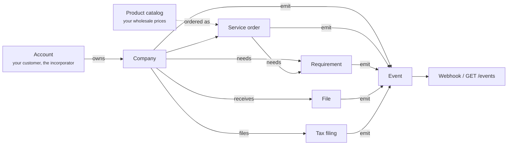
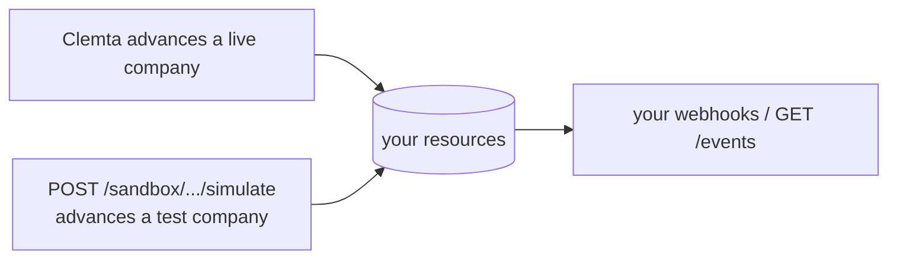

The Partner API lets you offer company formation and the services around it
under your own brand. You create companies for your customers. Clemta forms
them, files with the state and the IRS, and delivers the paperwork. You are
invoiced once a month at your wholesale prices. Your customer deals only with
you.

## The objects

| Object | What it is | Who moves it |
|---|---|---|
| **Account** (`acct_`) | Your customer - the person companies are formed for. Unique per email within your workspace. | You create it, or it is created with a company. |
| **Company** (`cmp_`) | One entity Clemta forms, or one that already existed and you bring in (`pre_existing: true`). | You create it. Clemta moves its `status`. |
| **Product** | One thing you can offer - formation, EIN, registered agent, bookkeeping - at your wholesale price. A read-only catalog. | Clemta, priced for you. |
| **Service order** (`so_`) | One product ordered on one company. Recurring products renew on their own. | You attach. Clemta fulfills, step by step. |
| **Tax filing** (`txf_`) | A federal or state return on a company. You buy the right to file, draft it, and submit. | You create and submit. Clemta reviews and files. |
| **Requirement** (`rqmt_`) | Something needed from you or your client: an identity document, a form for a fulfillment step, a new name, extra information. | Opened automatically or by Clemta. Fulfilled by you or, through a link, your client. |
| **File** (`file_`) | A document Clemta publishes on a company: Articles, EIN letter, filed forms. Read-only. | Clemta. |
| **Event** (`evt_`) | An immutable record of something that happened, with the resource snapshot embedded. | Clemta. Delivered to your webhooks and listed on [`GET /events`](/api-reference/list-events). |

Every resource carries an `object` field naming its type, so a handler can
switch on it wherever the resource arrives - nested under `expand[]`, inside an
event, or in a webhook.

## Modes and the sandbox

Every key is either `clmt_live_` or `clmt_test_`, and everything a key
touches inherits its mode. Test and live are separate worlds: a test key
never lists, reads, or changes a live object (an id from one never resolves in
the other), the same `Idempotency-Key` is a different key in each mode, a test
company is never fulfilled, and a test charge never rides a statement. Webhook
endpoints are registered per mode, so test events only reach test endpoints.

In test mode the whole surface works - companies, orders, requirements, files,
and tax filings all exist and every event fires - but nothing advances on its
own, because Clemta is not fulfilling it. You advance it:
[`POST /sandbox/companies/{id}/simulate`](/api-reference/create-sandbox-simulation) takes an `event` and the fields it
needs, and applies the change exactly as a live change would, the once-only
rules included, then delivers the resulting events to your test webhooks.

| `event` | fields | what happens |
|---|---|---|
| [`company.status.changed`](/api-reference/webhooks/company-status-changed) | `status` | status moves. First `active` also fires [`company.incorporated`](/api-reference/webhooks/company-incorporated) |
| `company.incorporated` | - | shorthand for `status: active` |
| [`company.verified`](/api-reference/webhooks/company-verified) | - | owners' identity settled |
| [`company.name.changed`](/api-reference/webhooks/company-name-changed) | `name` | |
| [`company.ein.assigned`](/api-reference/webhooks/company-ein-assigned) | `ein` | fires once. A second EIN updates silently |
| [`company.entitlements.changed`](/api-reference/webhooks/company-entitlements-changed) | `entitlements` | |
| [`service_order.status.changed`](/api-reference/webhooks/service-order-status-changed) | `order`, `step`, `form_required`, `completed` | `form_required` opens a `form` requirement |
| [`service_order.completed`](/api-reference/webhooks/service-order-completed) | `order` | fires once |
| [`tax_filing.created`](/api-reference/webhooks/tax-filing-created) / [`tax_filing.status.changed`](/api-reference/webhooks/tax-filing-status-changed) | `tax_filing` | |
| [`file.created`](/api-reference/webhooks/file-created) | `file_name` | a placeholder PDF is served from the content endpoint |
| [`requirement.created`](/api-reference/webhooks/requirement-created) | `message` | an `information` ask from Clemta |
| [`invoice.finalized`](/api-reference/webhooks/invoice-finalized) | - | a finalized invoice covering the company's test orders |

## The one design rule

Your customer is **yours**. Clemta never emails, texts, or otherwise contacts
the people behind a partner-created company. Their identity lives on your
account object, and they never become a Clemta user. The pages Clemta hosts for them
(identity verification, document signing) carry your brand. Everything that
would normally reach the customer reaches *you* instead, as an event - so you
can pass it on in your own voice. See [Whitelabel](/partner/whitelabel).

## Where to go next

- [Company lifecycle](/partner/company-lifecycle) - statuses, stages, and what fires when.
- [Requirements](/partner/requirements) - documents, forms and asks, and how your client can answer without an API key.
- [Service orders](/partner/service-orders) - ordering, fulfillment steps, and the form standard.
- [Files](/partner/files) - reading deliverables back.
