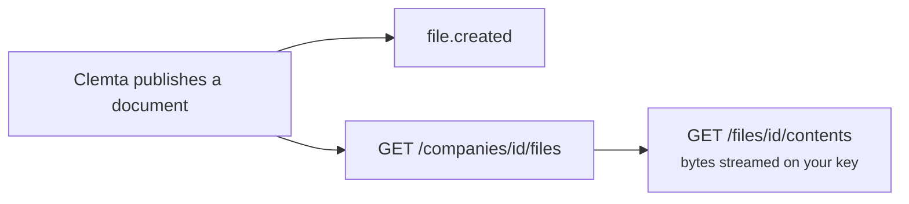

When Clemta publishes a document on one of your companies, it appears on
[`GET /companies/{id}/files`](/api-reference/list-company-files) and fires [`file.created`](/api-reference/webhooks/file-created). Formation deliverables,
filed state and IRS forms, and letters land here, alongside the files you
uploaded yourself. Each file's `source` says which it is: `operations` for a
document Clemta published (downloadable), `upload` for one you sent
(write-only).



## Reading

- [`GET /companies/{id}/files`](/api-reference/list-company-files) - one company's published documents, newest
  first: name, content type, size, when it was created.
- [`GET /v1/files`](/api-reference/list-files) - everything in your account, paginated, newest first: your
  uploads and Clemta deliverables alike. Filter by `purpose`, `source` and
  `company`.
- [`GET /files/{id}`](/api-reference/get-file) - one file's metadata.
- [`GET /files/{id}/contents`](/api-reference/get-file-content) - the bytes, streamed with the right
  `Content-Type` and `Content-Disposition`, on your API key. A downloadable
  file also carries a `url` pointing at this endpoint. There is no expiring
  storage link to share or leak.

## Uploading

[`POST /v1/files`](/api-reference/create-file) takes `multipart/form-data` with a `file` part and a
`purpose`. Purposes: `identity_document` (an owner's passport or government ID),
`additional_document` (a service form's file answer), `formation_document`,
`tax_form_1099`, `business_logo` and `business_icon`. PDF, JPEG or PNG, 10MB
max, images at most 8000px per side, and the bytes are verified against the
declared type.

```bash
curl https://api.clemta.com/v1/files \
  -H "Authorization: Bearer clmt_test_..." \
  -F purpose=identity_document \
  -F file=@passport.jpg
```

The response is a `file` with `source: upload`. Attach it by id - the only
API-side way to deliver a document:

- to a `document` requirement (`{"document": "file_..."}` on fulfill),
- as a form field's file value on fulfill,
- or directly at company create (`shareholders[].passport`), in which case no
  requirement opens and, when every owner arrives with a document, the company
  is handed to fulfillment immediately.

Uploads are **single-use** (`consumed` flips true once attached) and
**write-only**: the response carries no download URL, and the contents can never
be read back.

### Letting your client upload without a key

Your client can upload a document without holding any credential of yours,
through a verification session ([`POST /companies/{id}/verification-sessions`](/api-reference/create-verification-session)
returns a hosted `url`) or the requirement-link door
([`PUT /requirement-links/{token}/document`](/api-reference/put-requirement-link-document)). See
[requirements](/partner/requirements).

## Sharing a file

[`POST /v1/file-links`](/api-reference/create-file-link) over a shareable file mints a public `url` that serves the
bytes with no authentication until it expires. Only deliverables and branding
uploads can be linked - a client identity document is refused. `GET
/v1/file-links` lists your links, `GET /file-links/{id}` reads one, and `POST
/file-links/{id}` moves the expiry (set `expires_at` to `now` to revoke a URL
already in someone's hands). The public bytes live at `GET
/file-links/{token}/contents`.

## What is not returned

Identity documents your clients uploaded (passports) are **write-only**: they go
to Clemta for verification and are never listed or served back through the API.
Only shareable deliverables are readable. Client PII stays on your side.
