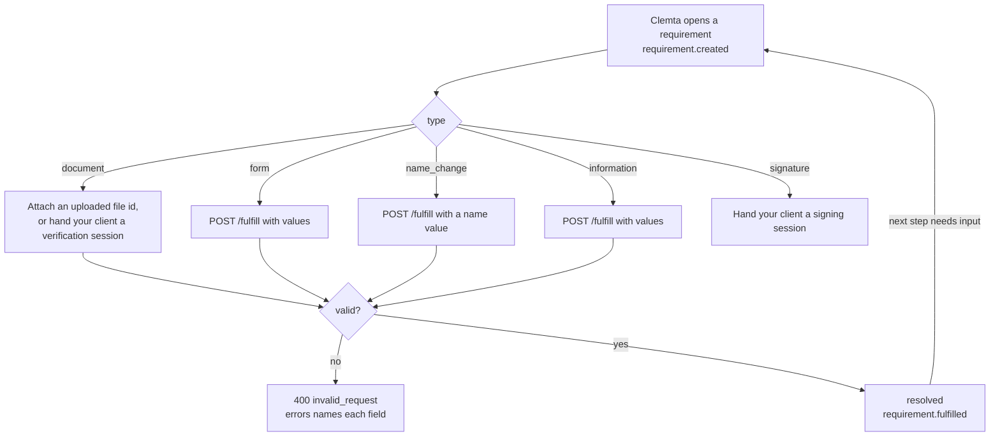

A **requirement** is a resolvable ask. When Clemta needs input to move a
company forward - an owner's identity document, the answers for a service-order
step, a new company name after a conflict, or extra information - it opens a
requirement and sends [`requirement.created`](/api-reference/webhooks/requirement-created). You resolve it, or hand it to your
client to resolve, and the process continues ([`requirement.fulfilled`](/api-reference/webhooks/requirement-fulfilled)).

## Types

| type | Opened when | Fulfilled with |
|---|---|---|
| `document` | A company is created (one per individual owner), or Clemta asks for a document. The `purpose` on the requirement says which file policy the upload is held to. | An uploaded file, by id: `document` (or `documents` for several pages) on `POST .../fulfill`. Or hand your client a verification session. |
| `form` | A service order reaches a step that needs input. | `POST .../fulfill` with `values[]`. A file field's value is a file id uploaded first ([`POST /v1/files`](/api-reference/create-file), purpose `additional_document`). |
| `name_change` | The state rejected the company name. | `POST .../fulfill` with `values: [{key: "name", value: "..."}]`. |
| `information` | Clemta needs something only you or your client know. | `POST .../fulfill` with `values[]`. |
| `signature` | A document needs signing. | Your client signs through a signing session. It resolves once every signer has signed. |

`requested_by` is `system` (opened automatically) or `operations` (Clemta
asked). `message` says why, in words you can show your client.

## Status

`open` -> `resolved` (fulfilled) or `canceled` (its order was cancelled, or
Clemta withdrew the ask). Fulfillment is atomic and single-shot: a second
fulfill of the same requirement answers `invalid_request` ("this requirement is
not open"). A canceled requirement carries a `cancel_reason` you can show your
client.

## Fulfilling a form

[`GET /requirements/{id}`](/api-reference/get-requirement) on an open `form` requirement returns `form`: the
schema of what to collect, in the [form standard](/partner/service-orders#the-form-standard)
- every field with its type, whether it is required, its options, conditional
rules, validation pattern and file constraints. Render it in your own UI or map
it onto data you already hold, then [`POST /requirements/{id}/fulfill`](/api-reference/fulfill-requirement) with
`values[]`. A file field's value is a file id you uploaded first (`POST
/v1/files`, purpose `additional_document`).

The server validates the whole submission against the schema before anything is
forwarded: required fields (respecting conditionals), types, options, patterns,
file types. A failure is one `400 invalid_request` whose `errors[]` names every
failing field. A valid submission advances the fulfillment workflow, and if the
next step needs input a new requirement opens.

## Fulfilling a document requirement

Upload the file first ([`POST /v1/files`](/api-reference/create-file), purpose `identity_document`), then
attach it by id on fulfill:

- **One file:** `{"document": "file_..."}`.
- **Multi-page** (a passport's front and back): `{"documents": ["file_...",
  ...]}`. The first is primary, and the page count is bounded by the purpose's
  policy (`max_files`).

The file is single-use. You can also attach a document at company create -
`shareholders[].passport` with a file id - in which case no requirement ever
opens for that owner, and when every owner arrives with a document the company
is handed to fulfillment immediately.

## Handing a requirement to your client

Your client can resolve a requirement **without an API key**:

- **Document requirements:** [`POST /companies/{id}/verification-sessions`](/api-reference/create-verification-session) with
  the owner's `shareholder` id returns a `url` - a hosted upload page. Hand or
  redirect your client to it. Live mode only, and the verification page must be
  configured first (your display name and privacy policy).
- **Signature requirements:** [`POST /companies/{id}/signing-sessions`](/api-reference/create-signing-session) with the
  `requirement` id returns a `url` to your branded signing page. When the
  document is signed the requirement resolves and you hear
  [`requirement.fulfilled`](/api-reference/webhooks/requirement-fulfilled).

Sessions are repeatable - mint another when one expires. The client can also
read what is asked, keyless: [`GET /requirement-links/{token}`](/api-reference/get-requirement-link-context) returns names
only, no ids.

## Listing

`GET /requirements?company=cmp_...&status=open` is the "what is outstanding"
view - what a dashboard would show, or what a nightly job would chase. Filter by
`company` and `status` (`open`, `resolved`, `canceled`). Each
[`requirement.created`](/api-reference/webhooks/requirement-created) webhook carries the same object, so you can also react as
they open.

## The hosted verification page

An identity document is the one ask your end client usually answers, so the
verification session `url` points at a neutral, branded page - no Clemta name in
the address bar. The page shows whose document is asked and accepts the upload.
The same token also accepts a direct [`PUT /requirement-links/{token}/document`](/api-reference/put-requirement-link-document)
if you would rather collect the file in your own UI: send the complete document
set in one request - one `multipart/form-data` part per page, or the raw bytes
of a single file with its `Content-Type`. Validation: PDF, JPEG or PNG, at most
10MB per file, at most 2 files, and the bytes must match the declared type. The
requirement closing closes the link.

## Embedding the hosted pages in your own site

By default the hosted upload and signing pages refuse to be framed - they are
full-page destinations, the safest posture against clickjacking. You can present
them inside your own site instead: register the origins allowed to frame them,
mint the session with `embed_origin`, and drop it in with the embed SDK. See
[Embedding hosted pages](/partner/embedding) for the full walkthrough.
