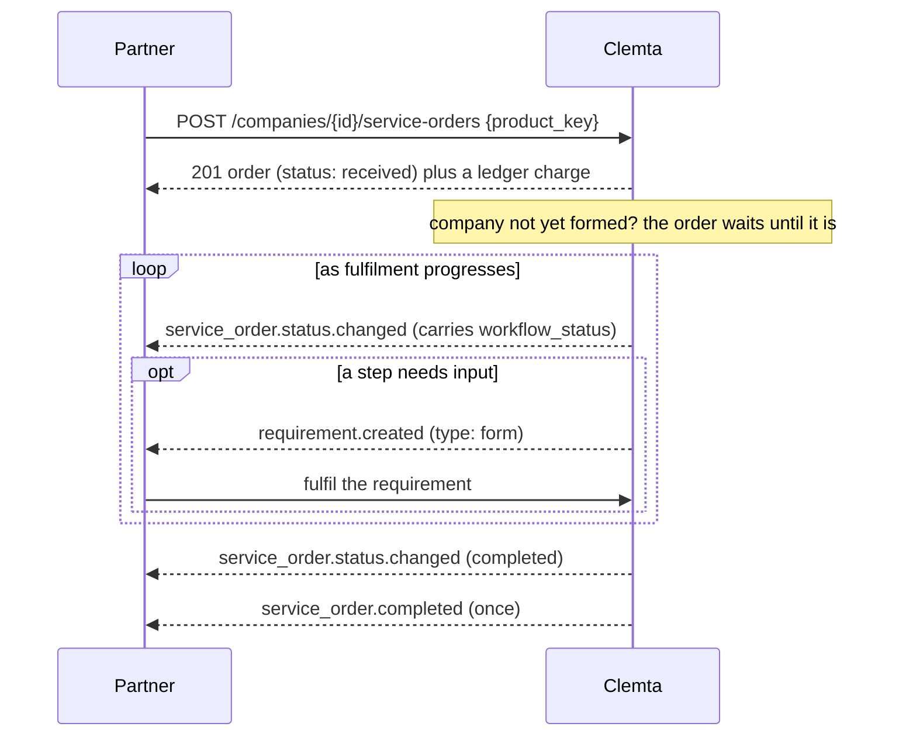
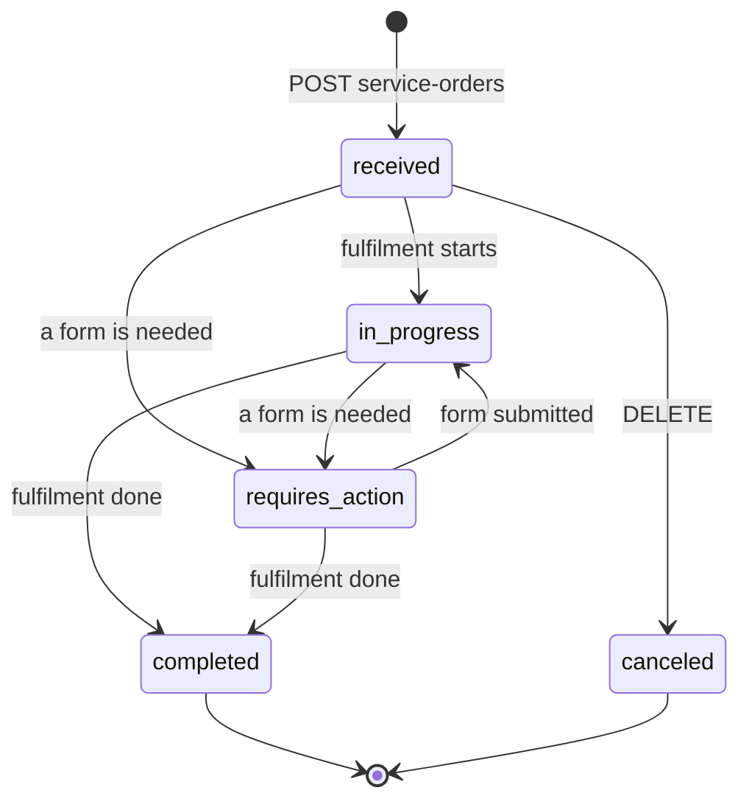
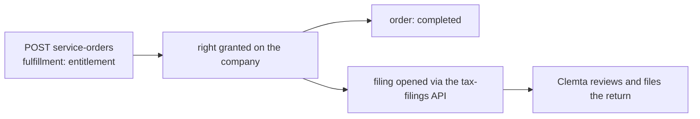

## Ordering

[`GET /products`](/api-reference/list-products) is your catalog: every product you may offer, at **your**
wholesale price (your negotiated rate, or the catalog default), with its
billing cadence and whether it auto-attaches to formations, existing
companies, or both. You order by `product_key`:

```bash
curl -X POST https://api.clemta.com/v1/companies/cmp_.../service-orders \
  -H "Authorization: Bearer clmt_live_..." -H "Idempotency-Key: 7c1e..." \
  -d '{"product_key": "ein"}'
```

The moment the order is created, one charge at that price is billed - that is
the billable event. A product is idempotent per company: attaching it twice
returns the existing order and charges nothing. Passing `services[]` on [`POST /companies`](/api-reference/create-company) attaches
products the same way, billed alongside the formation.



`GET .../service-orders/{id}` returns the **live** fulfilment step and, when
that step is waiting on input, the `form` to collect.

## Order status

`status` is a small, stable set Clemta derives for you. `workflow_status`
carries the current fulfilment step's own label for display, which varies per
product. Branch on `status`:

| `status` | Meaning | Next |
|---|---|---|
| `received` | Created and billed. Fulfilment not started. A cancellable state. | - |
| `quote_pending` | A priced-by-quote product is waiting for its price and your acceptance. Cancellable. | see [Products priced by quote](#products-priced-by-quote) |
| `in_progress` | Clemta is working the order. | wait for [`service_order.status.changed`](/api-reference/webhooks/service-order-status-changed) |
| `requires_action` | Fulfilment is waiting on a form from you or your client. An open `form` requirement names the fields. | fulfil the requirement |
| `completed` | Fulfilment is done. Terminal: `completed_at` is set once, [`service_order.completed`](/api-reference/webhooks/service-order-completed) fires once. | - |
| `canceled` | Cancelled before fulfilment. Terminal. | - |

Terminal states stick: a later correction Clemta makes after completion does
not reopen the order, and `service_order.completed` never fires a second time.
A test-mode order is not fulfilled and stays `received`.



## Availability

A product may be offered only to some companies. `available_when` on
[`GET /products`](/api-reference/list-products) is a match condition over the company's `entity_type`,
`state`, `pre_existing`, and `owners_count` - empty or absent means every
company. Ordering it for a company outside the condition is refused with
`400 invalid_request`, before anything is billed. A `required_for` product
outside its condition simply does not auto-attach. A single option value can
carry its own `available_when` too (an expedite offered in some states only).
Filter your own offer by it - what Clemta cannot deliver for a company is not
available to it.

## Two kinds of product: workflow and entitlement

Every product carries `fulfillment`:

- **`workflow`** (most services - EIN, BOI, trademark, and the like): Clemta
  fulfils the order, and you follow `status`, answering `form` requirements as
  they arrive.
- **`entitlement`** (tax filings): the order grants the company a **right** - a
  federal or state tax-filing credit - which you then exercise through the
  [tax-filings API](/partner/tax-filings). Nothing to follow on the order: it is
  `completed` at once and [`service_order.completed`](/api-reference/webhooks/service-order-completed) fires.



## Following a tax filing

An entitlement order shows up on the company as `entitlements` (a count per
entitlement product, keyed by product - `federal_tax_filing`,
`state_tax_filing`). Opening a filing ([`POST /companies/{id}/tax-filings`](/api-reference/create-tax-filing))
is free and makes a **tax filing** appear ([`tax_filing.created`](/api-reference/webhooks/tax-filing-created)). A
right is consumed only when you **submit** it, and
[`company.entitlements.changed`](/api-reference/webhooks/company-entitlements-changed) fires then. Read the filings with
[`GET /companies/{id}/tax-filings`](/api-reference/list-company-tax-filings). Follow one with
[`tax_filing.status.changed`](/api-reference/webhooks/tax-filing-status-changed), and see [Tax filings](/partner/tax-filings) for
the full flow:

| field | values | meaning |
|---|---|---|
| `status` | `draft` -> `in_review` -> `accepted` / `rejected` | review outcome |
| `progress` | `draft`, `in_progress`, `additional_info`, `signature_requested`, `return_ready`, `completed` | where Clemta has the return. `additional_info` and `signature_requested` need the client, `return_ready` means the return is in the company's files |

Clemta may also grant rights directly. That reaches you the same way, as
`company.entitlements.changed`. A client cannot start a filing without a right
- order the entitlement product for them to grant one.

## Product options (variants)

Some products come in variants - a federal tax filing for a single- or
multi-member LLC, say. [`GET /products`](/api-reference/list-products) lists each product's `options`: a
key, a label, whether it is `required`, and its `values`, each optionally
carrying its own `unit_amount`. Choose by sending `options` on the order:

```bash
curl -X POST https://api.clemta.com/v1/companies/cmp_.../service-orders \
  -H "Authorization: Bearer clmt_live_..." \
  -d '{"product_key": "federal_tax_filing", "options": {"llc_members": "multi_member"}}'
```

The order stores the choices, and the charge on your ledger is the value's
`unit_amount` when it has one - unless you hold a negotiated override on the
product, in which case that price applies whatever you choose. A missing
required option, an unknown key, or an unknown value answers
`400 invalid_request` with one `errors[]` entry per problem (with a "did you
mean" hint where one is close), so you fix the request in one round trip.
Options are catalog data, so a new variant appears on `GET /products` without
an API change on your side. Products that attach automatically (`required_for`)
never carry a required option.

## Upgrading options

`POST .../service-orders/{id}` with a new `options` set changes an in-flight
order's variant choices and bills you the price **difference** - moving an
`ein` order's `processing` from `standard` to `expedited` after the fact, for
example. Only upgrades are accepted (the new choice must not price below the
current one), the order must not be `completed` or `canceled`, the product's
`available_when` must still hold for the company as it stands now, and one
upgrade may stand at a time. An option marked `fixed` in the catalog cannot
change this way.

## Cancelling

`DELETE .../service-orders/{id}` cancels an order still in `received`. It
reverses the charge as a credit on your ledger, closes any open requirements
the order had, and fires [`service_order.status.changed`](/api-reference/webhooks/service-order-status-changed) (`canceled`).

An **active recurring** order takes a cancellation **request** instead: the
call stamps `renewal_cancel_requested_at` and Clemta decides. Renewals keep
billing until the request is approved. On approval the service runs to the end
of the current period (`renewal_ends_at`) and is not billed again - except a
product billed in arrears, whose running period still bills at its end. You
hear the outcome as [`service_order.renewal_canceled`](/api-reference/webhooks/service-order-renewal-canceled) or
[`service_order.renewal_cancel_denied`](/api-reference/webhooks/service-order-renewal-cancel-denied). Fulfilment status is untouched.

A one-time order already in fulfilment cannot be reversed and is refused with
`409`.

## Recurring services

A product's `interval` is `one_time`, `monthly`, or `yearly`. A recurring order
renews on its own: each period, one more charge at the price **captured on the
order** lands on your ledger and rides your next monthly statement. A later
price-sheet change never touches a running service. To stop renewals, cancel
the order (see [Cancelling](#cancelling)). There is no subscription object to
manage.

## Automatic products

A product can be marked `required_for` `formation` companies (ones Clemta
forms) and/or `existing` ones (pre-existing companies you bring in) - a Company
Maintenance fee, for instance. Creating such a company attaches and bills those
products whether or not you listed them. They appear on [`GET /products`](/api-reference/list-products) so you
can price them into your own offer.

## The form standard

Every input the platform asks for - a fulfilment step's form, an `information`
requirement - is expressed in one field definition, so one renderer on your
side handles all of them:

```json
{
  "key": "trademark_type",
  "field_name": "Trademark Type",
  "field_type": "select",
  "required": true,
  "options": ["Word Mark", "Logo Mark", "Figurative Mark"],
  "guidance": "Choose the kind of mark you are registering.",
  "help": "Most names are word marks.",
  "conditional": null,
  "validation": null,
  "file": null
}
```

| attribute | Meaning |
|---|---|
| `field_type` | `text`, `textarea`, `number`, `date` (YYYY-MM-DD), `boolean`, `select` (one of `options`), `multi_select` (a list of them), `file`, `email`, `phone`, `address`. |
| `required` | Must be answered - *when the field applies* (see `conditional`). |
| `conditional` | `{field, values[]}`: the field applies only while `field` holds one of `values`. A switched-off field is neither required nor validated. |
| `validation` | `pattern` (regex), `min_length`/`max_length`, `min`/`max` for numbers. |
| `file` | `accepted_types` (media types or extensions), `max_size_bytes`. A file field's value is a pre-uploaded file id ([`POST /v1/files`](/api-reference/create-file), purpose `additional_document`), sent in `values[]` like any other answer. |
| `guidance`, `help`, `note`, `placeholder`, `info_points` | Copy for your UI - guidance and help text to render alongside each field. |

Answers are `values[]` of `{key, value}`. The server validates the submission
against this definition and answers every failure at once:

```json
{
  "code": "invalid_request",
  "detail": "the submission has invalid fields",
  "errors": [
    {"reason": "is required", "location": "$.values[?(@.key=='first_use_date')]"},
    {"reason": "must be one of: Yes, No", "location": "$.values[?(@.key=='used_in_us')]"}
  ]
}
```

## Repeatable products

Most products follow the one-order-per-company rule: attaching the same
product twice answers the first order unchanged. Products that are bought
more than once carry a `repeat` policy on the catalog entry, and each
instance is its own order:

- `per_option:<key>` - one order per value of that option. A federal filing
  per `tax_year`, a sales tax registration per `state`, a bank application
  per `bank`. Sending the same value again answers the existing order.
- `per_shareholder` - one order per company owner. Name the owner with
  `shareholder` on the create body (an ITIN application), and the order carries
  it back as `shareholder`.
- `per_order` - every purchase is its own instance: the nth good-standing
  certificate, a further trademark filing.

## Products that exclude each other

A catalog entry may list `conflicts_with` - products a company cannot hold
beside it (Maintenance Plus already contains Maintenance, so holding both
would double-bill the same service). Ordering one while a non-canceled order
for the other stands is refused with the standing product named, and the
same rule covers a single creation basket carrying both.

## Order outcomes

Some orders end with an answer rather than a deliverable: a bank application
is approved or declined, a good-standing check can come back not eligible.
That answer appears as `outcome` on the order - on reads, and inside the
[`service_order.completed`](/api-reference/webhooks/service-order-completed) webhook payload. An outcome recorded after completion
announces [`service_order.updated`](/api-reference/webhooks/service-order-updated). A declined application is a delivered
service, so nothing is credited.

## Products priced by quote

Some work cannot be priced from a catalog - catch-up bookkeeping depends on
how many months and transactions there are. Such products carry
`quote: true`, and the order runs in three steps:

1. **Order it as usual.** The order opens at `status: quote_pending` with a
   `quote` object in `pending` state. Nothing is billed. Clemta reviews the
   records, and requirements may ask your client for bank statements at this
   stage.
2. **Clemta sets the price.** You hear [`service_order.quoted`](/api-reference/webhooks/service-order-quoted), and the order's
   `quote` now carries `unit_amount` and `expires_at` - the price stands for
   30 days.
3. **Accept it** with `{"accept_quote": true}` on the order update endpoint.
   The quoted amount becomes the order's price, the charge lands on your
   ledger at that moment, and fulfilment proceeds like any order. Accepting
   twice is idempotent.

Declining is simply cancelling the order (`DELETE`) - nothing was billed, so
nothing is credited. A lapsed quote refuses acceptance. Ask support to
re-price, and the 30-day window restarts.
