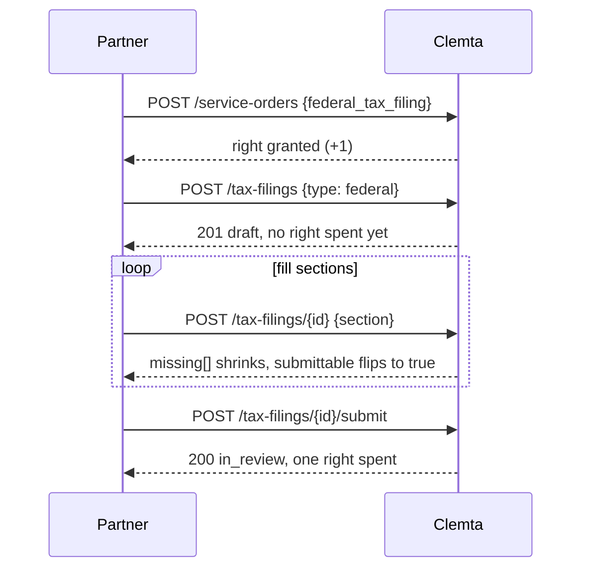

## How it works

A tax filing is an **entitlement**, not a workflow. You buy a **right** to file, draft the filing, fill it in, and submit it. Submitting spends one right. Drafting is free, so an abandoned draft never costs a right.

- `federal_tax_filing` is the annual federal return. It needs the company's **EIN** on file.
- `state_compliance_filing` is the state's annual report or franchise tax, available for **Delaware and Wyoming** today. On the company it shows as the `state_tax_filing` entitlement.

## Knowing when a filing is due

You do not track deadlines yourself. [`GET /companies/{id}/calendar`](/api-reference/list-company-calendar) lists a company's upcoming compliance items, annual report and tax deadlines included, soonest first, each with a `due_at`:

```bash
curl https://api.clemta.com/v1/companies/cmp_.../calendar \
  -H "Authorization: Bearer clmt_live_..."
```

A **[`calendar.reminder`](/api-reference/webhooks/calendar-reminder)** webhook fires ahead of every one, so you are told when a filing is coming up rather than polling for it. Relay that reminder to your customer under your own brand, then start the filing below.

## The flow



## 1. Buy the right

A filing right is ordered like any product. One order grants one right for the period:

```bash
curl -X POST https://api.clemta.com/v1/companies/cmp_.../service-orders \
  -H "Authorization: Bearer clmt_live_..." \
  -d '{"product_key": "federal_tax_filing"}'
```

Buy again for more, or use a yearly bundle that includes a filing and renews it each period. One right covers one submitted filing, per type, per year.

## 2. Create the draft

```bash
curl -X POST https://api.clemta.com/v1/companies/cmp_.../tax-filings \
  -d '{"type": "federal"}'
```

You get a `txf_` filing in `draft` with two things to work against:

- **`form`** the sections to fill in.
- **`missing`** what is still required, and **`submittable`** which is `true` once nothing is missing.

Already have everything? Pass `"form": {...}` and `"submit": true` to draft, fill, and submit in a single call.

## 3. Fill the sections

Send a section to replace it whole. Sections you leave out keep their stored value, so you can fill in several passes:

```bash
curl -X POST https://api.clemta.com/v1/companies/cmp_.../tax-filings/txf_... \
  -d '{"corp_info": {...}, "contact": {...}, "owners": [...]}'
```

The sections are `corp_info`, `contact`, `additional_questions`, `owners`, `revenue_expenses` (federal), `balance_sheet` (state), `officers`, and `directors`. `fixed_assets` is read-only on a filing - it is drawn from the company's register, so manage it with the fixed-assets API (`/companies/{id}/fixed-assets`), not here. Read the current state, `missing`, and `submittable` any time with `GET /tax-filings/{id}`.

## 4. Submit

```bash
curl -X POST https://api.clemta.com/v1/companies/cmp_.../tax-filings/txf_.../submit
```

Submit spends one right and moves the filing to `in_review`. It is refused when:

- **No right is available.** You get `entitlement_required` (403). Buy one first.
- **Readiness is not met.** The response names what is still `missing`.

Readiness checks, in short: federal needs the **EIN** on file, state must be **Delaware or Wyoming**, and if the company reports **1099** payments the forms must be attached before you submit.

## Track it

- [`GET /companies/{id}/tax-filings`](/api-reference/list-company-tax-filings) lists a company's filings and their status: `draft`, `in_review`, `accepted`, `rejected`.
- Webhooks: **[`tax_filing.created`](/api-reference/webhooks/tax-filing-created)** fires once per filing, **[`tax_filing.status.changed`](/api-reference/webhooks/tax-filing-status-changed)** on every move. Clemta reviews the submission and files the return, and you follow each state change on the webhook.
