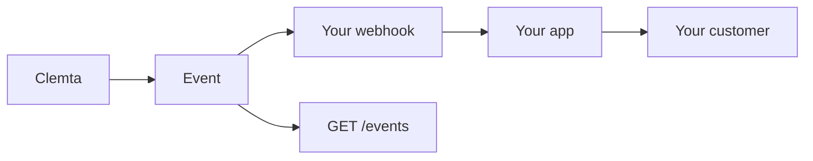

Every company you create is whitelabel. Clemta treats the people behind it as
yours, not as its own customers.

- **No emails, no SMS, no push** from Clemta to your customer or its owners, on
  any channel, ever.
- **No Clemta login.** An owner never gets a Clemta account. Their contact
  details live on your `account` object, not ours.
- **Your brand** on the pages Clemta hosts for an owner (identity verification
  and document signing): they carry the name, logo, and colors you configure, or
  nothing at all.

## What you get instead

Anything Clemta would have told the customer reaches **you** as an event, so you
can say it in your own voice, from your own domain.

| The moment | The event you receive |
|---|---|
| The company is incorporated | [`company.incorporated`](/api-reference/webhooks/company-incorporated) |
| The EIN is assigned | [`company.ein.assigned`](/api-reference/webhooks/company-ein-assigned), plus [`file.created`](/api-reference/webhooks/file-created) for the letter |
| An owner's ID is needed | [`requirement.created`](/api-reference/webhooks/requirement-created) (type `document`), then mint a verification session for a link to forward |
| A form is needed | `requirement.created` (type `form`) with its schema |
| The state rejects the name | `requirement.created` (type `name_change`) |
| A document is ready | `file.created` |
| A service moves forward | [`service_order.status.changed`](/api-reference/webhooks/service-order-status-changed) |

## Share status without a key

For a customer or teammate who only needs to watch progress, mint a status token
with [`POST /companies/{id}/status-tokens`](/api-reference/create-status-token). Anyone holding the token can read the
company's live status from [`GET /status/{token}`](/api-reference/get-status) with no API key, and you revoke
it in one call. Use it to drive a progress view in your own product without
handing out your key.
